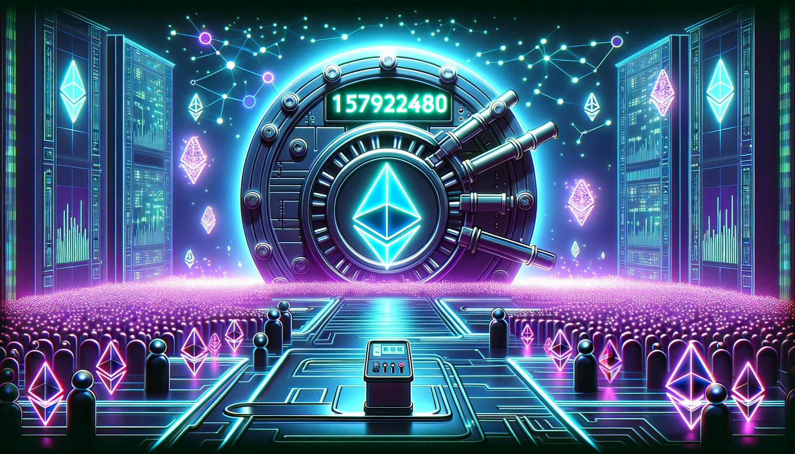

<h1 align="center">🏦 ERC4626 OSx Plugin</h1>

<p align="center">
  
  <br>
  <i> A ERC4626 vault that uses an Aragon DAO for storage and management of the underlying asset.</i>
  <br>
</p>

<p align="center">
  <a href="https://github.com/pythonpete32/erc4626-osx-plugin/actions"></a>
  <a href="https://getfoundry.sh/"></a>
  <a href="https://opensource.org/license/agpl-v3/"></a>
  <a href="https://use-aragon.daobox.app"></a>
  <a href="https://discord.gg/d5nCgVt4kE"></a>

</p>

<hr>

[gha]: https://github.com/pythonpete32/erc4626-osx-plugin/actions
[gha-badge]: https://github.com/pythonpete32/erc4626-osx-plugin/actions/workflows/ci.yml/badge.svg
[foundry]: https://getfoundry.sh
[foundry-badge]: https://img.shields.io/badge/Built%20with-Foundry-FFDB1C.svg
[license]: https://opensource.org/license/agpl-v3/
[license-badge]: https://img.shields.io/badge/License-AGPL-blue.svg

<br />

## Getting Started

```sh
$ git clone git@github.com:pythonpete32/erc4626-osx-plugin.git
$ cd erc4626-osx-plugin
$ forge install
$ pnpm install # install Solhint, Prettier, and other Node.js deps
$ pnpm test
```

If this is your first time with Foundry, check out the
[installation](https://github.com/foundry-rs/foundry#installation) instructions.

<br />

## License

This project is licensed under AGPL-3.0-or-later.
